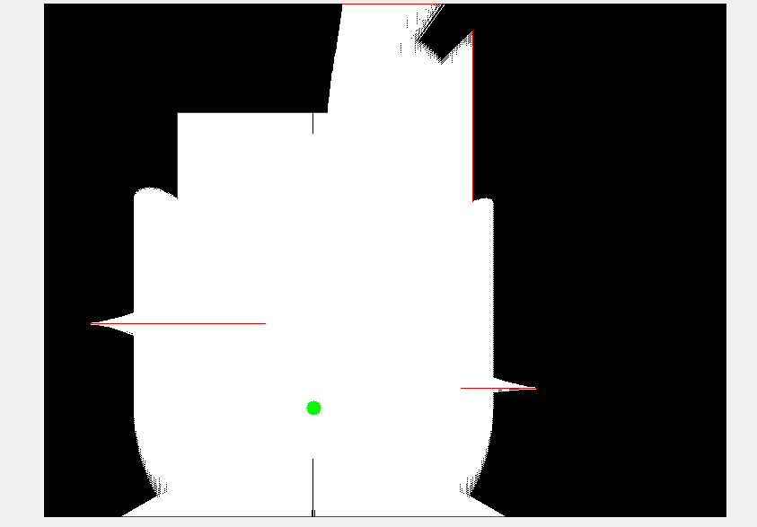
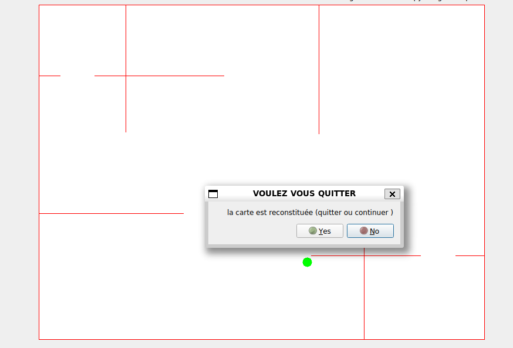

# Robot Autonome de Cartographie

## Introduction

Dans ce projet, nous avons développé un robot autonome capable d'explorer un environnement inconnu et de générer une carte de cet environnement à l'aide d'un capteur LiDAR. Le robot est capable de se déplacer de manière autonome, d'éviter les obstacles et de reconstruire une carte en temps réel en fonction de ses observations. Le défi consiste à gérer efficacement le déplacement du robot, l'acquisition des mesures LiDAR et la mise à jour de la carte.

## Prérequis

Ce projet nécessite l'installation des outils et bibliothèques suivants :

- **CMake (version 3.10 ou supérieure)** : Utilisé pour configurer et compiler le projet.
- **OpenCV** : Bibliothèque pour le traitement d'images et la vision par ordinateur.
- **GTK+3** : Bibliothèque pour l'interface graphique.
- **Qt5** : Bibliothèque pour l'interface graphique avec le module Qt5 Widgets.

## Utilisation

- **Entrez dans le répertoire de construction** :
    > 
      cd build
- **Configurer avec CMake** :
    >
       cmake ..
- **Compiler le projet** : 
    >
       make
- **Exécution**
    >   
       ./robot
                   
## Description du Projet

Le robot est équipé d'un capteur LiDAR qui lui permet de scanner son environnement à 360° et d'éviter les obstacles. À chaque étape de son exploration, il met à jour la carte, en marquant les obstacles détectés et en validant les zones dégagées. Le robot est programmé pour se déplacer de manière aléatoire, tout en ajustant sa trajectoire en fonction des obstacles détectés. Lorsqu'il se trouve près d'un obstacle ou d'un mur, il le suit pour continuer l'exploration.

## Fonctionnement du Robot

- **Déplacement aléatoire et suivi de murs** : Le robot se déplace en effectuant des déplacements aléatoires, en choisissant des directions où la distance à un obstacle est suffisante pour éviter les collisions. Si un obstacle est détecté à une certaine distance, le robot suit ce mur pour explorer.

- **LiDAR et cartographie** : Le LiDAR permet de mesurer la distance des obstacles dans toutes les directions (360°). Ces données sont utilisées pour mettre à jour la carte de l'environnement. Les obstacles sont marqués en rouge, et les espaces dégagés sont colorés en blanc.

- **Fin de simulation** : La simulation se termine lorsque le robot a exploré tout l'environnement, c'est-à-dire lorsqu'il n'y a plus de pixels noirs (indiquant des zones non explorées) dans la carte.

## Équations Mathématiques

Le déplacement du robot est calculé en utilisant les équations trigonométriques classiques pour obtenir les composantes du mouvement en fonction d'un angle donné :

- **Calcul des coordonnées du robot après un déplacement** :

>Soit un angle θ en radians (converti à partir de degrés) et une vitesse v :

    dx = v * cos(θ)  
    dy = v * sin(θ)

Ces équations permettent de calculer les nouvelles coordonnées (x, y) du robot en fonction de sa direction (angle) et de sa vitesse.

- **Calcul de la distance entre deux points (x1, y1) et (x2, y2)** : 

>
    distance = sqrt((x2 - x1)^2 + (y2 - y1)^2)
​
Cette formule est utilisée pour déterminer si le robot a suffisamment exploré l'environnement ou s'il doit changer de direction ou suivre un mur.

- **Détection des obstacles** : 

> Le LiDAR effectue des mesures à différents angles autour du robot et envoie les distances mesurées. Si la distance à un obstacle est inférieure à un seuil défini, le robot ajuste son mouvement pour éviter la collision.

## Structure du Code

- **Robot.hpp et Robot.cpp**

Les fichiers robot.hpp et robot.cpp définissent la classe Robot qui gère le déplacement du robot. Les principales fonctions sont :

> 
    randomMove : Déplacement aléatoire du robot.
    FollowWall : Suivi d'un mur lorsque l'obstacle est proche.
    autoMove : Déplacement autonome en fonction des données du LiDAR.

- **Lidar.hpp et Lidar.cpp**
La classe Lidar simule un capteur LiDAR. Elle génère des mesures de distance pour chaque angle autour du robot et renvoie ces informations sous forme de matrice **(cv::Mat)** . La méthode principale est :
> 
    getMeasurements: Obtient les distances à partir du LiDAR en fonction de la position du robot.
- **Map.hpp et Map.cpp** 
La classe Map représente la carte de l'environnement. Elle est initialisée à partir d'une image et est mise à jour avec les données du LiDAR. Les principales fonctions sont :

>   
    updateMap: Met à jour la carte en fonction des mesures LiDAR.
    getReconstructedMap: Récupère la carte reconstruite.

- **Main.cpp** 
Le fichier **main.cpp** est le point d'entrée du programme. Il initialise les composants du système (robot, LiDAR, carte) et lance la simulation, mettant à jour la position du robot et la carte à chaque itération.

## Démarche de Réflexion

- **Déplacement aléatoire et suivi de mur** : 
Le robot doit être capable de se déplacer de manière autonome sans entrer en collision. Le choix d'un déplacement aléatoire permet de simuler une exploration d'un environnement inconnu. Toutefois, en cas de détection d'obstacles, le robot doit suivre les murs pour poursuivre son exploration de manière plus systématique.

- **Cartographie** :
La mise à jour de la carte se fait à chaque mesure LiDAR, ce qui permet au robot de reconstruire l'environnement en temps réel. Les obstacles sont marqués en rouge et les espaces dégagés en blanc, offrant une visualisation claire de la progression de l'exploration.

## Capture d'écran

> 
    Principe  

> 
    outil

- **Simulation et interface graphique** :
Le programme est conçu pour s'exécuter dans un environnement de simulation. Une interface graphique est utilisée pour afficher la carte reconstruite et la position du robot. Lorsque l'exploration est terminée, une fenêtre de dialogue apparaît pour informer l'utilisateur et offrir la possibilité de quitter ou de continuer.

## Auteurs
> 
    **Terryl NGUETI**
    **William NDE FOTSO**
    **Nathan NGOUA ESSONO**  
